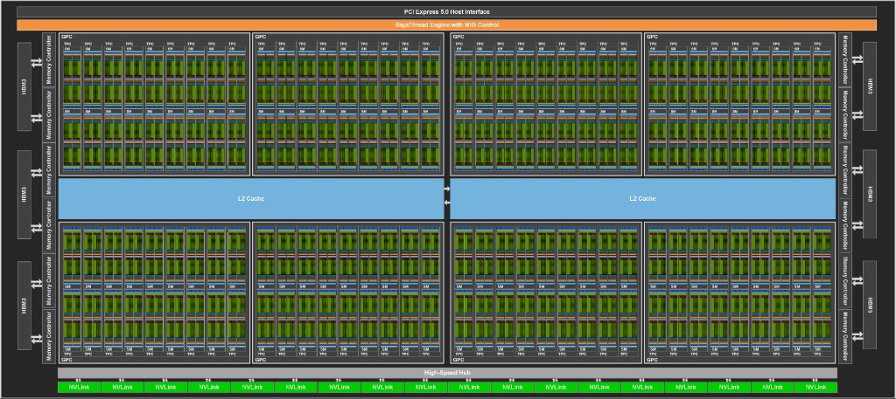
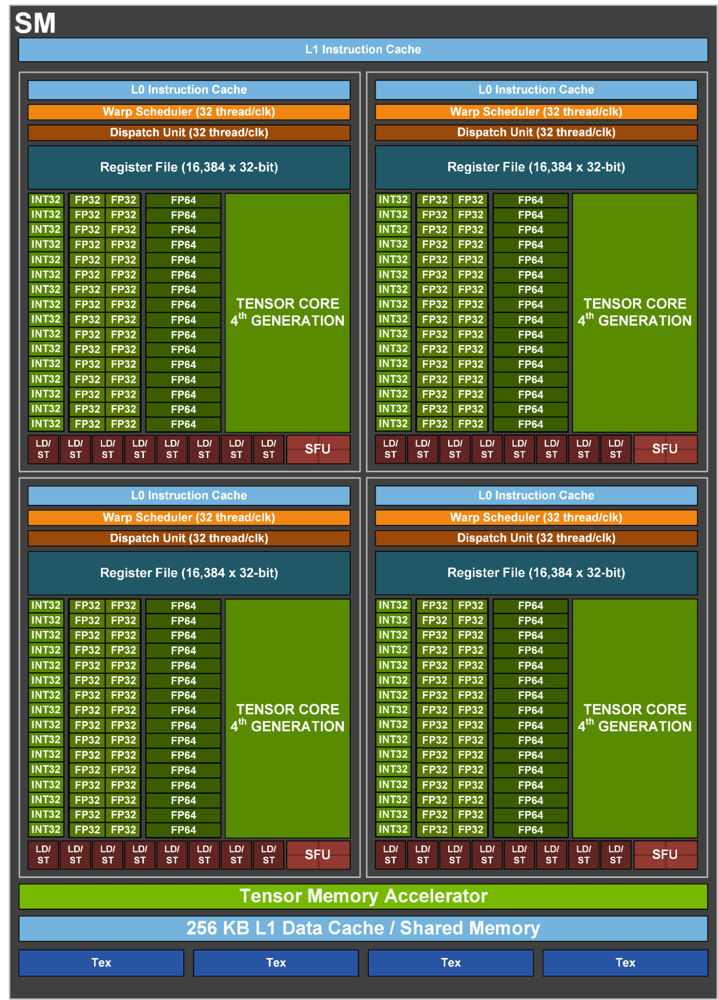

# GPU 架构详解：以 NVIDIA H100 为例

> 本文用两张图串起 H100（Hopper 架构）的硬件层次：**整卡拓扑**（GPC / TPC / SM / 显存 / 互联）与 **单个 SM 内部结构**（调度、执行单元、缓存）。从芯片全局下钻到 SM，对照 CUDA 编程模型做笔记。

**图 1 — 整卡：144 SM 的 H100 GPU**



**图 2 — 微观：单个 Streaming Multiprocessor**



---

## 1. 整卡鸟瞰：H100 芯片上有什么？

图 1 展示的是 GH100 芯片的**逻辑拓扑**（按功能块划分，非物理版图比例）。可以把整颗 GPU 想象成：**外围是显存与互联，中间是共享 L2，主体是大量 SM 组成的计算阵列**。

```
                    ┌─────────────────────────────┐
                    │  PCIe 5.0 Host Interface    │
                    ├─────────────────────────────┤
                    │ GigaThread Engine + MIG     │  ← 全局调度 / 多实例切分
                    ├─────────────────────────────┤
   HBM3 ←→ MC │  GPC×4（上）  │  L2 Cache  │  GPC×4（下）  │ ←→ MC ←→ HBM3
   (左×3)     │  每 GPC 9 TPC │  （中央）   │  每 GPC 9 TPC │      (右×3)
              ├───────────────┴────────────┴───────────────┤
              │         NVLink × 18（GPU 间高速互联）        │
              └─────────────────────────────────────────────┘
```

### 1.1 计算阵列：GPC → TPC → SM

| 层级 | 英文全称 | 图中数量 | 职责 |
|------|----------|----------|------|
| **GPC** | Graphics Processing Cluster | **8** | 一大块计算集群，内含9个 TPC,18个SM，共享片内互连 |
| **TPC** | Texture Processing Cluster | **72**（8×9） | 纹理相关管线 + **2 个 SM** 的组合单元 |
| **SM** | Streaming Multiprocessor | **144**（8*18） | 真正执行 CUDA 线程的单元（见本文第 2 节起） |

```
GPC（×8）
 └── TPC（每 GPC ×9，共 72）
      └── SM（每 TPC ×2，共 144）  ← 与 CUDA **线程块**的调度目标对应
```

**笔记**：TPC 名字来自图形学时代的「纹理处理集群」，但在 CUDA 语境下，你只需记住——**SM 才是算力与线程块调度的基本单位**，TPC/GPC 是物理分组。

**SKU（型号） 差异**：图 1 画满 **144 SM** 代表 GH100 完整 die 规模；市售 H100 SXM5 等型号通常**启用约 132 SM**（其余为良率预留或未熔丝），PCIe 版可能更少。用 `cudaGetDeviceProperties` 的 `multiProcessorCount` 以实卡为准。

### 1.2 片外与片内存储

| 组件 | 位置（图 1） | 作用 |
|------|--------------|------|
| **HBM3** | 左右各 3 栈，共 **6 栈** | 高带宽显存（Global Memory 的物理载体） |
| **Memory Controller** | HBM 与计算阵列之间，共 **12** 个 | 管理 HBM 读写、与 L2 / SM 之间的数据通路 |
| **L2 Cache** | 中央两大块蓝色区域 | **全 SM 共享**的二级缓存，缓存在 HBM 与 SM 之间 |

**访存路径（简化）**：

```
SM 内寄存器 
        ↕
SM 内 Shared Memory / L1 Data Cache (L1 Cache和Shared Memory共享一块256K的统一内存池，SRAM, 这256K可以按照比例配置为L1 Cache和Shared Memory, 但是L1 Cache是由硬件自动管理的， Shared Memory则需要程序员手动管理, 查找时先找Shared Memory， 再找L1 Cache)
        ↕
      L2 Cache（整卡共享，容量约 50 MB 级，依 SKU）
        ↕
 Memory Controller → HBM3
```

你在 kernel 里访问的 `cudaMalloc` 分配的对象，逻辑上在 **Global Memory（HBM）**；命中路径会依次尝试 L1 → L2，未命中则走 HBM，延迟和带宽差一个数量级。

### 1.3 控制与互联

| 组件 | 说明 |
|------|------|
| **PCIe 5.0 Host Interface** | GPU 与 CPU/主板之间的主通道；`cudaMemcpy` H↔D、kernel 启动命令经此下发 |
| **GigaThread Engine** | 全局线程块调度器：把 Grid 中的**线程块**分配到各 SM |
| **MIG Control** | **Multi-Instance GPU**：把一张物理卡切成多个独立 GPU 实例（不同租户/任务隔离） |
| **High-Speed Hub & NVLink** | 底部 **18 路 NVLink**，用于多卡直连、高带宽 P2P，训练集群常见 8×H100 NVSwitch 拓扑 |

### 1.4 一次 Kernel 在整卡上的旅程

把图 1 与 CUDA 启动语法连起来：

```
1. Host 通过 PCIe 提交 kernel<<<grid, block>>> 及参数
2. GigaThread Engine 把 Grid 拆成多个**线程块Block**，投入各 SM 的任务队列
3. 某 SM 上的 Warp 执行 load/store：
      - 数据若在寄存器/Shared → 本地完成
      - 否则经 L1 →（可能）L2 →（未命中）HBM
4. 多卡场景下，另一张卡的数据可经 NVLink 而非绕回 CPU
5. 结果经 PCIe 回传 Host，或留在显存供下一 kernel 使用
```

| 逻辑概念（CUDA） | 硬件概念（图 1 + 图 2） |
|------------------|-------------------------|
| Grid | 整卡所有 SM 共同承载的 kernel 实例 |
| Block | GigaThread 分配到**某一个 SM** 的工作包 |
| Warp（32 线程） | SM 内 Warp Scheduler 的最小调度单位 |
| Thread | SM 内寄存器 + 执行单元上的一条执行车道 |
| Global Memory | HBM3，经 Memory Controller 与 L2 访问 |
| `__shared__` | 图 2 中 SM 底部 256 KB 区域（非 L2） |

**关键结论**：`<<<grid, block>>>` 在整卡上被 **GigaThread Engine** 切成**线程块Block**队列，再映射到 **144（或实卡启用的 132）个 SM** 之一；进入 SM 后，再由各**处理分区**上的 Scheduler 以 **Warp** 为粒度发射指令（见下文第 2 节）。

---

## 2. 下钻到 SM：四象限 + 共享资源

图 2 展示的 H100 SM 采用**四分区（Quad-Partitioned）**设计：中间是 **4 个完全相同的 Processing Block（处理块）**，上下则是 SM 级共享资源。

```
┌───────────────────────────────────────────────────────────────────────────────────────┐
│                           L1 Instruction Cache（共享）                                 │
├─────────────────────┬─────────────────────┬───────────────────────────────────────────┤
│ Processing Block 0  │ Processing Block 1  │ Processing Block 2  │ Processing Block 3  │
├─────────────────────┴─────────────────────┴─────────────────────┴─────────────────────┤
│  Tensor Memory Accelerator (TMA)                                                      │
│  256 KB L1 Data Cache / Shared Memory                                                 │
│  Tex（Texture Units）× 4                                                              │
└───────────────────────────────────────────────────────────────────────────────────────┘
```

这种设计的意图是：在单个 SM 内**并行调度更多 Warp**，同时让指令取指、数据访存和计算流水线尽量互不阻塞。

---

## 3. 整卡 ↔ SM：两级笔记对照

| 问题 | 在图 1（整卡）找答案 | 在图 2（SM）找答案 |
|------|----------------------|---------------------|
| 有多少算力单元？ | 8 GPC × 9 TPC × 2 SM = **144 SM** | 每 SM：128 FP32、4 Tensor Core… |
| **线程块Block**在哪执行？ | 被 GigaThread 分到某个 **SM** | 进入 SM 后，由 4 个**处理分区Processing Block**上的 Scheduler 调度 Warp |
| Global 数据从哪来？ | **HBM3** → MC → **L2** | SM **LD/ST** → L1 →（未命中）回到 L2/HBM |
| 线程间快速共享？ | 不行（**线程块**不跨 SM） | 可以：**Shared Memory**（256 KB 池，线程块内共享） |
| 多卡通信？ | **NVLink** | 对单 SM 透明，由驱动/NVSHMEM 等封装 |

**延迟数量级（帮助建立直觉，非精确基准）**：

| 存储层级 | 大致相对延迟 | 谁共享 |
|----------|--------------|--------|
| 寄存器 | 1× | 线程私有 |
| Shared Memory / L1 | 低 | **线程块Block**内线程（同一 SM 上） |
| L2 | 更高 | 整卡所有 SM |
| HBM3 | 最高 | 整卡 Global Memory |

---

## 4. 指令通路：从 Cache 到执行单元

每个**处理分区Processing Block**顶部是一条**取指 → 调度 → 发射**的流水线。

### 4.1 L1 / L0 Instruction Cache

| 组件 | 位置 | 作用 |
|------|------|------|
| **L1 Instruction Cache** | SM 顶部，四块共享 | 缓存即将执行的指令，减少从显存取指的开销 |
| **L0 Instruction Cache** | 每个**处理分区Processing Block**独立 | 更小、更低延迟的指令缓存，服务本分区的 Warp |

**与编程的关系**：分支多、代码体积大的 kernel 更容易造成**指令 Cache 压力**和 **Warp 分化（divergence）**——同一 Warp 内线程走不同分支时，硬件会串行执行各分支路径，有效吞吐下降。

### 4.2 Warp Scheduler（32 thread/clk）

- 每个**处理分区Processing Block**有 **1 个 Warp Scheduler**，整个 SM 共 **4 个**。
- 标注 **32 thread/clk** 表示：每个时钟周期最多为一个 Warp（32 线程）选出下一条要执行的指令。
- 调度器负责在**就绪的 Warp 之间切换**——某个 Warp 在等内存时，立刻换另一个 Warp 执行，这是 GPU **用大量线程隐藏延迟**的核心机制。

### 4.3 Dispatch Unit（32 thread/clk）

- 将调度器选中的指令**发射（issue）**到下游的具体执行单元（FP32、INT32、LD/ST 等）。
- 与 Scheduler 配合，完成"选 Warp → 选指令 → 送到对应功能单元"的最后一步。

```
  L1 Inst Cache
       ↓
  L0 Inst Cache（每处理分区Processing Block）
       ↓
  Warp Scheduler  ←→  在多个活跃 Warp 间切换
       ↓
  Dispatch Unit   →  INT32 / FP32 / FP64 / Tensor / LD/ST / SFU
```

---

## 5. 寄存器堆：线程私有的"工作台"

每个**处理分区Processing Block**拥有：

> **Register File（16,384 × 32-bit）**

整个 SM 合计约 **65,536 个 32 位寄存器**（16,384 × 4）。

| 要点 | 说明 |
|------|------|
| 用途 | 存放线程的局部变量、中间结果、地址计算等 |
| 分配方式 | 由编译器 + 硬件在 kernel 启动时**静态划分**给各 Warp |
| 与 Occupancy 的关系 | 每个线程用的寄存器越多 → 同一 SM 能同时驻留的 Warp 越少 → **Occupancy（占用率）**可能下降 |

**编程启示**：

- 减少不必要的局部变量和大数组，有助于提高 Occupancy。
- `nvcc` 编译时可加 `--ptxas-options=-v` 查看每个 kernel 的寄存器用量。
- 寄存器溢出到 **Local Memory**（实际在显存中）会显著拖慢性能。

---

## 6. 执行单元：各类"计算核心"

每个**处理分区Processing Block**内有一组专用功能单元，负责不同类型的运算。

### 6.1 标量 / 向量浮点与整数单元

| 单元 | 每处理分区数量 | 每 SM 合计 | 典型用途 |
|------|---------------|------------|----------|
| **INT32** | 16 | 64 | 整数运算、地址计算、循环计数 |
| **FP32** | 32 | 128 | 单精度浮点（`float`），通用计算主力 |
| **FP64** | 16 | 64 | 双精度浮点（`double`），科学计算 |

同一 Warp 的 32 个线程在对应单元上**同步执行同一条指令**（SIMT）。若线程间出现分支分歧，硬件会**掩码（mask）**执行各分支，直到 reconverge。

### 6.2 第四代 Tensor Core

- 每个**处理分区Processing Block**有 **1 块第四代 Tensor Core**（图中绿色大块），SM 共 **4 块**。
- 专为**矩阵乘累加（GEMM）**等深度学习核心算子设计。
- H100 支持 **FP8、FP16、BF16、TF32、INT8** 等多种低精度格式，吞吐远高于普通 FP32 单元。
- 编程接口：`wmma` API、cuBLAS、CUTLASS、框架底层算子等。

**何时走 Tensor Core**：数据类型和矩阵维度满足要求时，应优先用库或 WMMA；普通 element-wise kernel 仍主要用 FP32 单元。

### 6.3 Load/Store 单元（LD/ST）

- 每**处理分区Processing Block** **8 个**，SM 共 **32 个**。
- 负责寄存器与各级存储器之间的数据搬运（global / shared / local）。
- **合并访存（Coalesced Access）**：同一 Warp 访问连续地址时，硬件可合并为少量事务，带宽利用率高；随机或非对齐访问则成为常见瓶颈。

### 6.4 特殊函数单元（SFU）

- 每**处理分区Processing Block** **1 个**，SM 共 **4 个**。
- 处理 `sin`、`cos`、`exp`、`sqrt`、`rcp` 等超越函数。
- 吞吐量低于普通 FP32 乘加，热点路径上可用多项式逼近或 `__fast_*` 内建函数权衡精度与速度。

---

## 7. 存储层次：SM 底部的共享资源

### 7.1 256 KB L1 Data Cache / Shared Memory

图中底部浅蓝色长条是 H100 SM 上**最重要的可编程存储器**：

- **容量**：256 KB（具体划分可在 L1 Cache 与 Shared Memory 之间动态配置，依架构与驱动策略而定）。
- **双重角色**：
  - **L1 Data Cache**：缓存对 Global Memory 的访问，对程序员基本透明。
  - **Shared Memory**：通过 `__shared__` 声明，**线程块Block**内线程显式共享，需配合 `__syncthreads()` 使用。

```
Global Memory (HBM，高带宽但高延迟)
        ↕ LD/ST
L1 Data Cache / Shared Memory (256 KB，低延迟)
        ↕
Register File (最快，线程私有)
```

**经典优化模式**：Tiled 矩阵乘法、Reduction 分块等，都是把反复访问的数据先搬进 Shared Memory，减少对 Global Memory 的访问次数。

### 7.2 Tensor Memory Accelerator（TMA）

- Hopper 架构**新增**的专用数据搬运单元（图中 TMA 绿色长条）。
- 在 **Global Memory ↔ Shared Memory** 之间以异步、高吞吐方式搬移多维张量块，减轻 LD/ST 和寄存器压力。
- 主要服务于 **CUDA Graph、CUTLASS、cuBLAS** 等库及 Hopper 专用 kernel；一般入门 kernel 不直接使用，但理解它有助于认识 H100 为何在大模型训练中带宽利用更好。

### 7.3 Texture Units（Tex）

- SM 底部 **4 个**纹理单元。
- 擅长带缓存的**空间局部性**访问（图像采样、插值、某些不规则但 2D 相邻的访存模式）。
- CUDA 中可通过纹理内存 API 使用；图形和部分 HPC 场景常见。

---

## 8. 单 SM 资源汇总（便于记忆）

将图中**每个处理分区Processing Block的数量 × 4** 即可得到整个 SM 的峰值资源（理论值，实际可用量受 Occupancy、指令混合等影响）：

| 资源 | 每处理分区 | 每 SM（×4） |
|------|----------|-------------|
| Warp Scheduler | 1 | 4 |
| Dispatch Unit | 1 | 4 |
| 32-bit 寄存器 | 16,384 | 65,536 |
| INT32 核心 | 16 | 64 |
| FP32 核心 | 32 | 128 |
| FP64 核心 | 16 | 64 |
| 第四代 Tensor Core | 1 | 4 |
| LD/ST 单元 | 8 | 32 |
| SFU | 1 | 4 |
| L1 Data / Shared Memory | — | 256 KB（共享） |
| Texture Unit | 1 | 4 |
| TMA | — | 1（SM 级共享） |

---

## 9. 与 CUDA 编程模型的对应关系

把前面的硬件概念和日常写 kernel 的经验对齐：

| 你写的代码 / 概念 | 在 H100 SM 上的体现 |
|-------------------|---------------------|
| `<<<grid, block>>>` | **线程块Block**被分配到某个 SM；多个线程块可排队或并行占满多 SM |
| `threadIdx` / `blockIdx` | 决定线程全局索引，进而影响访存地址是否合并 |
| Warp（32 线程） | Scheduler 调度的最小单位；分化分支导致串行 |
| `__shared__` | 使用 256 KB 区域中的 Shared Memory 部分 |
| 寄存器局部变量 | 占用 Register File；过多则降低 Occupancy |
| Global Memory 读写 | 经 LD/ST，命中则走 L1 Data Cache |
| `double` 密集计算 | 主要占用 FP64 单元，峰值吞吐低于 FP32 |
| 矩阵乘 / 深度学习 | 应尽量让第四代 Tensor Core 承担主要算力 |

### 9.1 一个向量加法的"旅程"（简图）

以 `C[i] = A[i] + B[i]` 为例：

```
Host 经 PCIe 启动 kernel
    → GigaThread Engine 把**线程块**分配到某个 SM（图 1）
    → 线程块内线程每 32 个组成 Warp，由某**处理分区**的 Scheduler 调度（图 2）
    → Warp Scheduler 选中 Warp，Dispatch 发射 LD 指令
    → LD/ST：先查 L1 → 未命中则 L2 → 再未命中则 HBM3
    → FP32 单元执行加法
    → LD/ST 写回 C[i]（同样经 L1/L2 写回 HBM）
    → 若等内存，Scheduler 切换到同 SM 内其他 Warp
```

---

## 10. 对性能优化的启示

结合**整卡（图 1）**与 **SM（图 2）**，优化时可按下面顺序自查：

1. **并行度是否吃满整卡**：Grid 的**线程块**数是否 ≥ SM 数（如 132+），避免大量 SM 空转？
2. **Occupancy**：寄存器、Shared Memory 用量是否限制了单 SM 内同时活跃的 Warp 数？
3. **访存**：Global 访问是否合并？能否用 Shared Memory 分块，减少对 HBM 的往返？
4. **L2 友好**：多 SM 反复读同一块数据时，是否利于 L2 复用（如只读常量、合理 tile 尺寸）？
5. **指令吞吐**：计算是否受限于 FP32/FP64 峰值？能否改用 Tensor Core？
6. **Warp 分化**：`if/else` 是否导致同一 Warp 内线程走不同路径？
7. **特殊函数**：是否过度使用 SFU 上的超越函数？
8. **多卡 / 数据通路**：训练是否用 NVLink P2P，避免经 PCIe 绕 Host？
9. **架构特性（H100）**：大规模 GEMM / Attention 是否可利用 TMA + Tensor Core 的库实现？

工具建议：用 **Nsight Compute** 查看 `sm__throughput`、`l1tex__t_sectors_pipe_lsu_mem_global_op_ld.sum` 等指标，对照上述硬件单元定位瓶颈。

---

## 11. 小结

**整卡（图 1）**：

- **8 GPC × 9 TPC × 2 SM = 144 SM** 构成计算主体；实卡常见 **132 SM** 启用。
- **6 栈 HBM3 + 12 个 Memory Controller** 提供 Global Memory 带宽。
- **中央 L2** 为所有 SM 共享，是 HBM 与 SM 之间的重要缓冲。
- **GigaThread Engine** 负责**线程块**级调度；**PCIe** 连 Host，**NVLink** 连多卡。

**单个 SM（图 2）**：

- **四象限并行**：4 个**处理分区**，各有 Scheduler、寄存器堆和计算单元（≠ CUDA 线程块）。
- **SIMT 执行**：以 Warp（32 线程）为单位取指、调度、发射。
- **分层存储**：寄存器 → Shared Memory / L1 →（经 L2）→ HBM。
- **专用加速**：第四代 Tensor Core + TMA。

两张图合在一起，回答 CUDA 程序员最关心的链条：**Host 下发 → 线程块落到哪个 SM → Warp 在处理分区上如何跑 → 数据从 HBM 怎么流到寄存器**。优化原则——足够多的**线程块**、合并访存、Shared Memory 分块、避免 Warp 分化、矩阵交给 Tensor Core、多卡走 NVLink——都对应图中具体硬件单元，而不是抽象口号。

---

## 参考资料

- [NVIDIA H100 Tensor Core GPU Architecture](https://resources.nvidia.com/en-us-tensor-core/nvidia-tensor-core-gpu-datasheet)（白皮书）
- [CUDA C++ Programming Guide — Hardware Implementation](https://docs.nvidia.com/cuda/cuda-c-programming-guide/index.html#hardware-implementation)
- [NVIDIA Hopper Architecture In-Depth](https://developer.nvidia.com/blog/nvidia-hopper-architecture-in-depth/)
