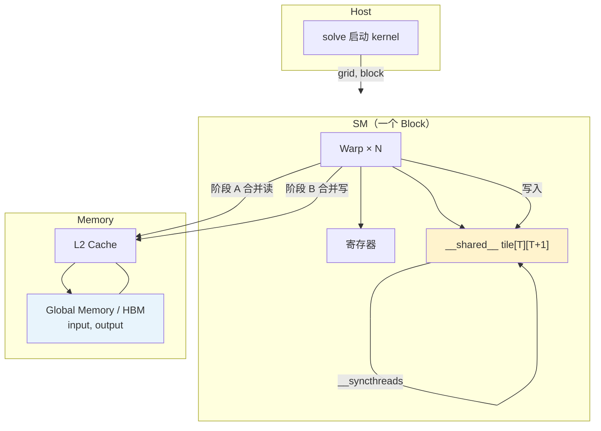

# 从 LeetGPU Matrix Transpose 入手：GPU 体系结构与转置优化

> **题目**：[LeetGPU — Matrix Transpose](https://leetgpu.com/challenges/matrix-transpose)  
> **目标**：用一道经典访存题，把 **显存 / 共享内存 / Warp / 分块 / 合并访存 / Bank 冲突** 串成一条完整的 GPU 体系结构认知链，并给出可直接提交的优化代码。

---

## 0. 题目在考什么？

LeetGPU 要求：给定 `float` 矩阵 `input`（`rows × cols`，**行主序**），在 GPU 上计算转置 `output`（`cols × rows`）。

```text
input[row][col]  →  output[col][row]

线性下标：
  input  : index = row * cols + col
  output : index = col * rows + row
```

接口（评测环境已分配好显存，只需写 kernel 与 `solve`）：

```cpp
extern "C" void solve(const float* input, float* output, int rows, int cols);
```

转置本身几乎没有浮点计算（每个元素一次赋值），性能几乎**完全由访存模式**决定——这正是学习 GPU 内存层次的最佳入口。

---

## 1. GPU 体系结构鸟瞰：数据从哪来、到哪去？

把一次 kernel 执行想象成一条流水线，从整卡到单个线程：

```text
Host (CPU)
    │  PCIe：下发 kernel<<<grid, block>>>、传参
    ▼
GigaThread Engine          ← 把 Grid 里的 Block 分配到各 SM
    │
    ▼
SM（Streaming Multiprocessor）  ← 一个 Block 落在某一个 SM 上
    │
    ├── Warp Scheduler       ← 以 Warp（32 线程）为最小调度单位
    ├── 寄存器（每线程私有，最快）
    ├── LD/ST 单元           ← 负责 load/store 指令
    ├── 256 KB L1 / Shared   ← 同一块可配置为 L1 Cache 或 __shared__
    └── … FP32 / Tensor Core 等
    │
    ▼
L2 Cache（整卡共享）
    │
    ▼
HBM3 显存（Global Memory）   ← cudaMalloc 分配的数据在这里
```

### 1.1 与 CUDA 编程模型的对应

| CUDA 概念 | 硬件含义 | 转置题中的角色 |
|-----------|----------|----------------|
| **Grid** | 整次 kernel 在所有 SM 上的工作 | 覆盖整个 `rows × cols` 矩阵 |
| **Block** | 分配到**某一个 SM** 的线程组 | 通常对应矩阵的一个 **Tile（分块）** |
| **Warp** | SM 内 32 个连续线程，同步执行 | 决定 global 访存能否**合并** |
| **Thread** | 一条执行车道 + 私有寄存器 | 处理 1 个（或几个）矩阵元素 |
| **Global Memory** | HBM 显存 | `input` / `output` 数组 |
| **`__shared__`** | SM 片上 SRAM，Block 内共享 | Tile 缓冲区，做块内转置 |

更细的 H100 SM 结构见 [H100-Streaming-Multiprocessor-SM.md](H100-Streaming-Multiprocessor-SM.md)。

### 1.2 延迟与带宽：为什么要优化访存？

| 存储层次 | 典型延迟 | 谁管理 | 转置优化中的用法 |
|----------|----------|--------|------------------|
| 寄存器 | ~1 cycle | 编译器 | 暂存从 shared 读出的值 |
| Shared Memory | ~20 cycle | **程序员**（`__shared__` + `__syncthreads`） | Tile 中转，换合并的 global 访问 |
| L1 / L2 | 不等 | 硬件自动 | 重复访问同一 cache line 时受益 |
| Global (HBM) | 400~800 cycle | 程序员决定访问模式 | 读/写 `input`、`output` |

HBM 带宽很高（数百 GB/s～数 TB/s），但**延迟极高**。GPU 靠海量线程掩盖延迟；若访存模式差（非合并），有效带宽会暴跌，SM 空等内存。

**转置的困境**：行主序下「按行读、按列写」天然 stride 很大 → 必有一侧 global 访问不合并。优化核心就是：**用 Shared Memory 分块，让两侧 global 访问都变成「相邻线程访问相邻地址」。**

---

## 2. 执行单位：Warp 与合并访存（Coalesced Access）

### 2.1 Warp 是什么？

- 一个 Block 内，`threadIdx` 连续的 **32 个线程**组成一个 Warp。
- Warp Scheduler **以 Warp 为单位**发射指令，同一时刻 Warp 内 32 线程执行同一条指令（分支分化时例外）。
- LD/ST 单元处理 global load/store 时，会把**同一 Warp 内 32 个线程的地址**尽量合并成 **1～2 次** 128 字节左右的内存事务。

> **注意**：**合并访存（Coalesced Access）发生在访问 Global Memory（显存）时**。若同一 Warp 的 32 个线程访问的显存地址连续、对齐，硬件一次性搬回；若地址分散（大 stride、随机），则需多次事务，速度变慢。Shared Memory 有自己的一套 **Bank** 规则，见第 4 节。

### 2.2 合并 vs 非合并：一维直觉

```cpp
// ✅ 合并：lane i 访问 a[base + i]，地址连续
int i = blockIdx.x * blockDim.x + threadIdx.x;
float v = a[i];

// ❌ 非合并：lane i 访问 a[i * stride]，stride 大时地址分散
float v = a[i * cols];  // 按列读行主序矩阵时常见
```

### 2.3 二维线程块里如何判断？

**固定 Block，选一个 Warp**（例如 `threadIdx.y` 相同、`threadIdx.x = 0..31`），写出 32 个线程的**线性地址**：

- 连续 → 合并
- 间隔 `stride × sizeof(T)` → 通常不合并

---

## 3. 分步剖析：Naive → 分块 → 去 Bank 冲突

### 3.1 Naive 版：读合并，写不合并

```cpp
__global__ void transposeNaive(const float* input, float* output,
                               int rows, int cols) {
    int col = blockIdx.x * blockDim.x + threadIdx.x;
    int row = blockIdx.y * blockDim.y + threadIdx.y;
    if (col < cols && row < rows) {
        output[col * rows + row] = input[row * cols + col];
    }
}
```

设 `blockDim = (32, 32)`，考察 `threadIdx.y` 相同的一个 Warp（`threadIdx.x = 0..31`）：

| 阶段 | 表达式 | `col` 变化 | 地址间隔 | 合并？ |
|------|--------|-----------|----------|--------|
| 读 `input` | `row * cols + col` | 连续 +1 | 4 字节 | ✅ |
| 写 `output` | `col * rows + row` | 连续 +1 | `rows × 4` 字节 | ❌ |

```text
行主序 input（同一行 y 上连续）:
  [y,0] [y,1] [y,2] ... [y,31]
    ↑     ↑     ↑         ↑
   Warp 连续读 → 1 次事务

行主序 output（写转置元素）:
  写 [0,y] [1,y] [2,y] ...  间隔 rows 个 float → 32 次分散写
```

Naive 版能跑对，但在大矩阵上有效带宽往往只有峰值的一小部分。

### 3.2 分块（Tiling）+ Shared Memory：两侧 global 都合并

**思路**：每个 Block 负责 input 中一个 `TILE × TILE` 的子块：

1. **阶段 A**：按行主序**合并读** input → 写入 `__shared__ tile`
2. **`__syncthreads()`**：等 Block 内所有线程写完 shared
3. **阶段 B**：在 shared 里等价于做了块内转置；**交换 Block 在 grid 中的坐标**，使写 output 时仍是行主序**合并写**

```text
        Global input                Shared tile              Global output
      ┌─────────────┐            ┌──────────┐            ┌─────────────┐
Block │ 合并读  →   │  ──────►   │ 块内转置  │  ──────►   │  ← 合并写   │
      └─────────────┘            └──────────┘            └─────────────┘
         阶段 A                    __syncthreads              阶段 B
```

这就是 **分块技术（Tiling）** 在转置中的标准用法：用片上 Shared Memory（高带宽、低延迟）做一次数据重排，换取两侧 Global 的合并访问。矩阵乘法、卷积、Reduction 的分块也是同一思想。

### 3.3 块内转置后为何还要「交换 block 坐标」？

阶段 A 中 Block `(bx, by)` 读的是 input 的左上角在 `(by*TILE, bx*TILE)` 的区域（`x` 对应 col，`y` 对应 row）。

转置后，这块数据应写到 output 的 `(bx*TILE, by*TILE)` 位置（output 形状为 `cols × rows`）。因此阶段 B 要把：

```text
x = bx * TILE + tx   →   x = by * TILE + tx
y = by * TILE + ty   →   y = bx * TILE + ty
```

这样写 `output[y * cols_out + x]` 时，`x`（即 `threadIdx.x`）连续 → **合并写**。

---

## 4. Shared Memory 与 Bank Conflict

### 4.1 Bank 是什么？

- Shared Memory 被划分为 **32 个 Bank**（与 Warp 宽度一致），典型宽度 4 字节。
- 地址 `addr` 落在 `bank = (addr / 4) % 32`。
- **同一 Warp** 内，若 32 个线程同时访问**不同地址但同一 Bank** → **Bank Conflict**，硬件串行化，相当于 32 路变 1 路。

| 访问模式 | 结果 |
|----------|------|
| 32 线程访问 32 个不同 Bank | 无冲突，1 周期 |
| 32 线程访问同一地址 | 广播，无冲突 |
| 32 线程访问同 Bank 不同地址 | **32-way 冲突** |

### 4.2 转置在 Shared 里为何冲突？Padding 为何能修好？

#### 第一步：先弄清 Bank 怎么编号

Shared Memory 按 **4 字节** 为一格划入 32 个 Bank（Bank 0～31），循环使用：

```text
字节偏移:  0   4   8  ...  124  128  132  ...
Bank:      0   1   2  ...   31    0    1   ...
           └──── 32 格 ────┘  └── 又从 Bank 0 开始
```

公式：`bank(字节偏移) = (字节偏移 / 4) % 32`

`float` 占 4 字节，所以也可以说：**每数 32 个 float，Bank 编号就循环一圈**。

#### 第二步：无 Padding 时，按列读为何 32 路冲突？

`__shared__ float tile[32][32]` 按行主序排布，`tile[row][col]` 相对数组开头的 **float 下标** 为 `row * 32 + col`。

阶段 B 读 `tile[threadIdx.x][threadIdx.y]`。考察一个 Warp：`threadIdx.y` 相同、`threadIdx.x = 0..31`（CUDA 中 `threadIdx.x` 变化最快，相邻 lane 往往 x 连续）：

```text
32 个线程读的是：
  tile[0][ty], tile[1][ty], tile[2][ty], …, tile[31][ty]
  └─ 同一列 col=ty，行号 row 从 0 变到 31 ─┘   →  沿「列」访问
```

每个元素的 float 下标 = `row * 32 + ty`，相邻两行间隔 **32 个 float**：

```text
row=0 → 下标 ty        → Bank = ty % 32
row=1 → 下标 32 + ty    → Bank = (32 + ty) % 32 = ty % 32
row=2 → 下标 64 + ty    → Bank = ty % 32
...
row=31 → 下标 992 + ty  → Bank = ty % 32
```

**32 个线程全部落在同一个 Bank 上** → **32-way Bank Conflict**，硬件把 32 次访问串成 32 拍，等价于带宽除以 32。

根因就一句话：**行宽 32 恰好是 Bank 数量 32 的整数倍**，行与行之间地址差 128 字节，差 32 个 Bank 格，所以**每一列上的元素永远落在同一 Bank**。

```text
无 padding，tile[32][32] 按列看（固定 col=0）：

  row 0  tile[0][0]  ─┐
  row 1  tile[1][0]   │  32 个元素
  row 2  tile[2][0]   │  全在 Bank 0
  ...                 │
  row31  tile[31][0] ─┘
```

#### 第三步：Padding 如何打破「每列同一 Bank」？

把声明改成：

```cpp
__shared__ float tile[32][32 + 1];  // 每行 33 个 float，多出来的 1 列只用于错位
```

行主序下，`tile[row][col]` 的 float 下标变为 **`row * 33 + col`**（行宽从 32 变成 33）。

仍看按列读 `tile[tx][ty]`（`tx = 0..31`，固定 `ty`）：

```text
float 下标 = tx * 33 + ty
Bank       = (tx * 33 + ty) % 32
           = (tx * 1 + ty) % 32    ← 因为 33 % 32 = 1
           = (tx + ty) % 32
```

当 `ty` 固定、`tx` 从 0 到 31 时，`(tx + ty) % 32` 取遍 **0～31 各一次** → **32 个线程命中 32 个不同 Bank** → **无冲突**。

```text
有 padding，tile[32][33] 按列看（固定 col=0）：

  row 0  tile[0][0]  → Bank 0
  row 1  tile[1][0]  → Bank 1   （比上一行多 33 float，33 mod 32 = 1，Bank +1）
  row 2  tile[2][0]  → Bank 2
  ...
  row31  tile[31][0] → Bank 31
```

**多出来的那一列元素不会被阶段 B 用到**，它的作用纯粹是「垫高」每一行的起始 Bank，让**下一行相对上一行在 Bank 上错开 1 格**，而不是错开 0 格（32 的整数倍）。

#### 小结对照

| | `tile[32][32]` | `tile[32][33]`（+1 padding） |
|--|----------------|-------------------------------|
| 行宽（float） | 32 | 33 |
| 相邻两行同一列的 Bank 差 | 32 mod 32 = **0**（相同） | 33 mod 32 = **1**（递增） |
| Warp 按列读 | 32 线程 → 1 个 Bank | 32 线程 → 32 个 Bank |
| 结果 | 32-way 冲突 | 无冲突 |

阶段 A 按行写 `tile[ty][tx]` 时，`tx` 连续 → 访问 `row*33+tx` 连续 float → Bank 本来就连续，**padding 不会破坏行方向的访问**；它专门修的是阶段 B 按列读时的冲突。

### 4.3 Padding 写法（代码）

```cpp
__shared__ float tile[TILE][TILE + 1];  // +1：行宽变为 33，打断「列 → 同 Bank」
```

更一般的经验：`TILE_DIM` 为 32 的倍数时，加 **1** 个 padding 即可；若 `TILE_DIM` 为 16，同样 `[16][17]` 有效（17 mod 32 = 17，相邻行 Bank 差 17，与 32 互质即可打散）。

| 技巧 | 作用层次 | 转置中的效果 |
|------|----------|--------------|
| Tiling + Shared | Global 合并 | 读写 HBM 都高效 |
| `[TILE][TILE+1]` padding | Shared Bank | 块内转置读 shared 不串行 |
| `#pragma unroll` + 每线程多元素 | 指令 / 占用率 | 隐藏延迟，LeetGPU 上常再快一截 |

---

## 5. 优化演进路线图

```text
Naive                    Tiled + Shared           Tiled + Padding + ILP
  │                            │                          │
  │ 读合并、写stride            │ 读写 global 都合并        │ 同上 + 减 bank 冲突
  │                            │ + 消除写侧非合并            │ + 每线程处理多行
  ▼                            ▼                          ▼
baseline                  ~3–4× 带宽提升              LeetGPU 竞赛常用
```

---

## 6. 完整代码（LeetGPU 可直接提交）

以下三档由浅入深；**推荐提交「优化版」**（第三节的 `solve`）。

### 6.1 版本一：Naive（理解用，评测偏慢）

```cpp
#include <cuda_runtime.h>

__global__ void transposeNaive(const float* __restrict__ input,
                               float* __restrict__ output,
                               int rows, int cols) {
    int col = blockIdx.x * blockDim.x + threadIdx.x;
    int row = blockIdx.y * blockDim.y + threadIdx.y;
    if (col < cols && row < rows) {
        output[col * rows + row] = input[row * cols + col];
    }
}

extern "C" void solve(const float* input, float* output, int rows, int cols) {
    dim3 block(16, 16);
    dim3 grid((cols + block.x - 1) / block.x,
              (rows + block.y - 1) / block.y);
    transposeNaive<<<grid, block>>>(input, output, rows, cols);
    cudaDeviceSynchronize();
}
```

### 6.2 版本二：Shared Memory + Padding（核心优化）

#### 6.2.1 一个 Block 负责一个 Tile

把整个 `input` 矩阵在逻辑上切成若干 **不重叠的方形分块（Tile）**，每块大小 `TILE_DIM × TILE_DIM`（这里 `TILE_DIM = 32`）。

**关键约定：Grid 里的每一个 Block，恰好处理 input 上的某一个 Tile。**

```text
input（rows × cols，行主序）按 Tile 切分：

  col →  0        32       64      ...
       ┌─────────┬─────────┬─────
row  0 │ Block   │ Block   │
  ↓ 32 │ (0,0)   │ (1,0)   │     blockIdx.x 沿 col 方向递增
       │ Tile    │ Tile    │     blockIdx.y 沿 row 方向递增
       ├─────────┼─────────┤
     64 │ Block   │ Block   │
       │ (0,1)   │ (1,1)   │
       └─────────┴─────────┘

Block (bx, by) 负责的 input 区域（全局坐标）：
  col ∈ [bx * 32, bx * 32 + 31]
  row ∈ [by * 32, by * 32 + 31]

该 Block 内 32×32 = 1024 个线程，与 Tile 内元素一一对应：
  threadIdx.x → Tile 内列偏移（0..31）
  threadIdx.y → Tile 内行偏移（0..31）
```

| 概念 | 本 kernel 中的取值 | 含义 |
|------|-------------------|------|
| `blockDim` | `(32, 32)` | 每个 Block 1024 线程，铺满一个 Tile |
| `grid` | `((cols+31)/32, (rows+31)/32)` | 列方向、行方向各要多少块才能盖住矩阵 |
| `blockIdx.x` | `bx` | 当前 Block 是第几列块 |
| `blockIdx.y` | `by` | 当前 Block 是第几行块 |
| `threadIdx` | `(tx, ty)` | 线程在**本 Tile 内**的行列偏移 |

**片上资源**：每个 Block 私有一块 `__shared__ float tile[32][33]`，就是本 Tile 在 SM 上的「草稿纸」。Block 内所有线程先协作把 Global 数据搬进 `tile`，在 `tile` 里完成块内转置，再协作写回 Global。**不同 Block 的 `tile` 互不共享。**

#### 6.2.2 两阶段在做什么？

```text
Block (bx, by) 的完整生命周期：

  阶段 A（读 input）
  ─────────────────────────────────────────
  Global input 上的一块          Shared tile（本 Block 私有）
  左上角 (by*32, bx*32)              ┌── 32 列 ──┐
       ┌──────────────┐              │ ty=0 一行  │  ← Warp：ty 相同，tx=0..31 合并读 input
       │  32 × 32     │  合并读 ──►  │ ty=1       │
       │  子矩阵      │              │  ...       │
       └──────────────┘              │ ty=31      │
                                     └────────────┘
                                            │
                                     __syncthreads()  等全员写完 tile
                                            │
  阶段 B（写 output）                        ▼
  ─────────────────────────────────────────
  逻辑：input 的 (row,col) 写到 output 的 (col,row)
  实现：把 Block 坐标 x/y 对调 → 写 output 时仍是行主序合并写

  Shared tile                      Global output 上的一块
  tile[tx][ty] 经转置索引           左上角 (bx*32, by*32)
       ┌──────────────┐              ┌──────────────┐
       │ 块内已转置   │  合并写 ──►  │  32 × 32     │
       │ 的数据布局   │              │  子矩阵      │
       └──────────────┘              └──────────────┘
```

阶段 A 用 `(bx, by)` 定位 **input 子块**；阶段 B 用 `(by, bx)` 定位 **output 子块**——这不是写错，而是转置后「行块 ↔ 列块」互换，才能保证写 `output` 时 `threadIdx.x` 连续对应连续内存。

#### 6.2.3 带注释的完整代码

```cpp
#include <cuda_runtime.h>

// 每个 Tile 的边长；也是 blockDim.x / blockDim.y
// 取 32 是因为 Warp 宽度为 32，同一行（ty 固定）的 32 个线程正好一个 Warp，便于合并访存
#define TILE_DIM 32

__global__ void transposeTiled(const float* __restrict__ input,
                               float* __restrict__ output,
                               int rows, int cols) {
    // -----------------------------------------------------------------------
    // 本 Block 在片上申请一块 Tile 缓冲区（仅本 Block 的 1024 个线程可见）
    // [TILE_DIM + 1] 是 padding：阶段 B 按列读 tile 时避免 32-way bank conflict
    // -----------------------------------------------------------------------
    __shared__ float tile[TILE_DIM][TILE_DIM + 1];

    // -----------------------------------------------------------------------
    // 阶段 A：从 Global input 合并读入本 Block 负责的那一个 Tile
    //
    // Block (blockIdx.x, blockIdx.y) = (bx, by) 覆盖 input 区域：
    //   row ∈ [by * TILE_DIM, by * TILE_DIM + TILE_DIM - 1]
    //   col ∈ [bx * TILE_DIM, bx * TILE_DIM + TILE_DIM - 1]
    //
    // 线程 (threadIdx.x, threadIdx.y) = (tx, ty) 负责该 Tile 内位置 (ty, tx) 的元素：
    //   global: input[row * cols + col] = input[(by*32+ty) * cols + (bx*32+tx)]
    //   shared: tile[ty][tx]  （用 threadIdx 作下标，与在 Tile 内的相对位置一致）
    // -----------------------------------------------------------------------
    int x = blockIdx.x * TILE_DIM + threadIdx.x;  // input 的全局列号 col
    int y = blockIdx.y * TILE_DIM + threadIdx.y;  // input 的全局行号 row

    if (x < cols && y < rows) {
        // 合并读：同一 Warp 内 ty 相同、tx 连续 → col 连续 → input 地址连续
        tile[threadIdx.y][threadIdx.x] = input[y * cols + x];
    }

    // 必须同步：阶段 A 所有线程写完 tile 后，阶段 B 才能读
    // 若某个线程因边界 if 未写入，仍须到达此屏障（本 kernel 中未写入的 tile 元素不会被阶段 B 使用）
    __syncthreads();

    // -----------------------------------------------------------------------
    // 阶段 B：从 tile 读出（块内转置索引），合并写入 Global output
    //
    // 转置映射：input(row, col) → output(col, row)
    // 原 Block (bx,by) 读入的 input 子块，对应 output 中左上角为 (bx*32, by*32) 的子块
    // 因此写 output 时用交换后的坐标：
    //   output 行号 row_out = bx * TILE_DIM + ty
    //   output 列号 col_out = by * TILE_DIM + tx
    //
    // 读 shared 时用 tile[tx][ty]（行列下标对调 = 块内转置）
    // 写 global 时 tx 连续 → col_out 连续 → output 行主序合并写
    // -----------------------------------------------------------------------
    x = blockIdx.y * TILE_DIM + threadIdx.x;  // output 的全局列号 col_out
    y = blockIdx.x * TILE_DIM + threadIdx.y;  // output 的全局行号 row_out

    if (x < rows && y < cols) {
        // output 形状为 cols × rows，行主序下标：row_out * rows + col_out
        output[y * rows + x] = tile[threadIdx.x][threadIdx.y];
    }
}

extern "C" void solve(const float* input, float* output, int rows, int cols) {
    // 一个 Block 处理一个 TILE_DIM×TILE_DIM 分块
    dim3 block(TILE_DIM, TILE_DIM);  // 1024 threads/block

    // grid.x：列方向需要多少块才能盖住 cols
    // grid.y：行方向需要多少块才能盖住 rows
    // 总 Block 数 = grid.x * grid.y，每个 Block 独立处理 input 的一块、写 output 的一块
    dim3 grid((cols + TILE_DIM - 1) / TILE_DIM,
              (rows + TILE_DIM - 1) / TILE_DIM);

    transposeTiled<<<grid, block>>>(input, output, rows, cols);
    cudaDeviceSynchronize();
}
```

#### 6.2.4 手算一例：Block (1, 0) 处理哪一块？

设 `TILE_DIM = 32`，`Block (bx=1, by=0)`：

| 阶段 | 坐标公式 | 本 Block 覆盖范围 |
|------|----------|-------------------|
| 阶段 A 读 input | `col = 1*32+tx`, `row = 0*32+ty` | input 的第 0～31 行、第 32～63 列 |
| 阶段 B 写 output | `col_out = 0*32+tx`, `row_out = 1*32+ty` | output 的第 32～63 行、第 0～31 列 |

**跟踪一个元素** `input[5][40]`（`row=5, col=40`）：

```text
1. 该元素属于 Block (bx=1, by=0) 的 Tile（行 0～31，列 32～63）

2. 阶段 A — 线程 (tx=8, ty=5) 负责载入：
     tile[ty][tx] = tile[5][8] ← input[5 * cols + 40]

3. __syncthreads() 后，块内转置：要写到 output[40][5] 的数据在 tile[5][8]

4. 阶段 B — 由 另一个线程 (tx=5, ty=8) 写出（读 tile[tx][ty] = tile[5][8]）：
     row_out = bx*32 + ty = 32 + 8 = 40
     col_out = by*32 + tx = 0  + 5 =  5
     output[40 * rows + 5] ✓

   注意：载入与写出通常不是同一个线程；Shared 里的下标对调 [ty][tx]→[tx][ty]
         完成了块内转置，再由不同线程合并写回 Global。
```

**Warp 视角**：阶段 A 中 `ty` 固定、`tx` 连续的 32 个线程读 input 同一行 → 合并读；阶段 B 中同样 `ty` 固定、`tx` 连续 → 写 output 同一行 → 合并写。

与本仓库 `stage2/kernels.cu` 中 `transposeShared` 逻辑一致，可直接本地对比 Naive 性能：

```bash
cd stage2 && make && ./main
```

### 6.3 版本三：Padding + 每线程多行（LeetGPU 推荐提交）

在 32×32 Tile 内，让每个线程沿列方向处理 `NUM_PER_THREAD` 行，提高指令级并行（ILP）、减少循环与分支开销；Block 形状改为 `(32, 8)`，总线程数仍为 256。

```cpp
#include <cuda_runtime.h>

template <int TILE_DIM, int NUM_PER_THREAD>
__global__ void transposeOptimized(const float* __restrict__ input,
                                   float* __restrict__ output,
                                   int rows, int cols) {
    __shared__ float tile[TILE_DIM][TILE_DIM + 1];

    const int bx = blockIdx.x;
    const int by = blockIdx.y;
    const int tx = threadIdx.x;
    const int ty = threadIdx.y;

    constexpr int ROW_STRIDE = TILE_DIM / NUM_PER_THREAD;

    // 阶段 A：合并读 input → shared（每线程负责 ROW_STRIDE 行）
    int x = bx * TILE_DIM + tx;
    int y = by * TILE_DIM + ty;
    if (x < cols) {
#pragma unroll
        for (int y_off = 0; y_off < TILE_DIM; y_off += ROW_STRIDE) {
            if (y + y_off < rows) {
                tile[ty + y_off][tx] = input[(y + y_off) * cols + x];
            }
        }
    }
    __syncthreads();

    // 阶段 B：交换 block 坐标，合并写 output
    x = by * TILE_DIM + tx;
    y = bx * TILE_DIM + ty;
    if (x < rows) {
#pragma unroll
        for (int y_off = 0; y_off < TILE_DIM; y_off += ROW_STRIDE) {
            if (y + y_off < cols) {
                output[(y + y_off) * rows + x] = tile[tx][ty + y_off];
            }
        }
    }
}

extern "C" void solve(const float* input, float* output, int rows, int cols) {
    constexpr int TILE_DIM = 32;
    constexpr int NUM_PER_THREAD = 4;  // 每线程 4 行，block = (32, 8)
    dim3 block(TILE_DIM, TILE_DIM / NUM_PER_THREAD);
    dim3 grid((cols + TILE_DIM - 1) / TILE_DIM,
              (rows + TILE_DIM - 1) / TILE_DIM);
    transposeOptimized<TILE_DIM, NUM_PER_THREAD>
        <<<grid, block>>>(input, output, rows, cols);
    cudaDeviceSynchronize();
}
```

**为何 `NUM_PER_THREAD = 4`？**  
`TILE_DIM / NUM_PER_THREAD = 8` 行/线程，`8 × 32 = 256` 线程/Block，占满常见 GPU 上较好的占用率；`#pragma unroll` 展开内层循环，让编译器调度更多独立 load/store。不同 GPU 上可尝试 `NUM_PER_THREAD = 2` 或 `TILE_DIM = 16` 做微调。

---

## 7. 知识串联：一图总结



| 你在代码里写的 | 硬件上发生的事 |
|----------------|----------------|
| `<<<grid, block>>>` | GigaThread 把 Block 分发给各 SM |
| `threadIdx.x` 连续的 Warp | 32 线程一次合并事务访问 HBM |
| `__shared__ tile` | 使用 SM 内 256KB 池中的 Shared 部分 |
| `tile[T][T+1]` | 避免 32 路 Bank Conflict |
| `__syncthreads()` | Block 内屏障，保证 tile 写满再读 |
| 交换 `blockIdx.x/y` | 不改变数学，只改变写 output 时的地址连续性 |

---

## 8. 本地验证

### 8.1 正确性

任意小规模矩阵，与 CPU 双重循环对比：

```cpp
void transposeCpu(const float* in, float* out, int rows, int cols) {
    for (int r = 0; r < rows; ++r)
        for (int c = 0; c < cols; ++c)
            out[c * rows + r] = in[r * cols + c];
}
```

### 8.2 性能

用 `cudaEvent_t` 计时，有效带宽近似：

```text
带宽 (GB/s) ≈ 2 × rows × cols × sizeof(float) / 时间(s) / 1e9
```

（读+写各一遍，故 ×2。）

### 8.3 Profiler（可选）

Nsight Compute 中关注：

- `Memory Throughput` / `DRAM Throughput`
- `Global Load/Store Efficiency`
- `Shared Load Bank Conflict`（Padding 前后对比）

---

## 9. 自检清单

- [ ] 能画出 Naive 转置「读合并、写不合并」的地址间隔
- [ ] 能解释 Tiling 如何用 Shared Memory 让**读写 global 都合并**
- [ ] 能说明 `tile[32][32]` 按列读时为何 32-way Bank Conflict
- [ ] 能解释 `[TILE][TILE+1]` padding 如何打散 Bank
- [ ] 能区分：**合并访存**（Global）与 **Bank 冲突**（Shared）
- [ ] 能写出 LeetGPU 的 `solve` 启动配置：`grid` 覆盖 `cols × rows` 的 Tile 网格
- [ ] 知道 Warp = 32 线程，是调度与合并访存的基本单位

---

## 10. 延伸阅读

| 资料 | 内容 |
|------|------|
| [CoalesedMemoryAccess.md](CoalesedMemoryAccess.md) | 合并访存专题笔记 |
| [stage2_内存模型与调试.md](stage2_内存模型与调试.md) | 本仓库转置练习与 benchmark |
| [stage3_性能优化.md](stage3_性能优化.md) | Memory-bound 瓶颈、AoS/SoA |
| [H100-Streaming-Multiprocessor-SM.md](H100-Streaming-Multiprocessor-SM.md) | SM、Warp、L1/Shared、LD/ST |
| [NVIDIA 官方转置博客](https://developer.nvidia.com/blog/efficient-matrix-transpose-cuda-cc/) | Naive → Coalesced → No Bank Conflict 三阶段 |
| [LeetGPU Matrix Transpose](https://leetgpu.com/challenges/matrix-transpose) | 在线评测 |

---

## 附录：符号对照

| 符号 | 含义 |
|------|------|
| `rows`, `cols` | input 的行数、列数（LeetGPU 接口） |
| `input[r * cols + c]` | 行主序下 `(r, c)` 元素 |
| `output[c * rows + r]` | 转置后 `(c, r)` 元素 |
| `TILE_DIM` | 分块边长，通常 32（= Warp 宽度） |
| `TILE_DIM + 1` | Padding 列宽，消除 Bank 冲突 |
